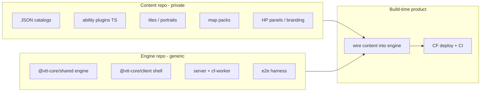

# Engine / Hellpiercers Content Split (High Level)

**Repo home:** [`vtt-core`](/Users/lindenholt/code/vtt-core) (this repository). Historical monolith copy: `` — do not continue structural work there.

**Status:** Tracks A–E + close-gaps + Open B + parents **#2**–**#10** **done**. Content is `git+https://github.com/acedrow/hellpiercers-content.git#semver:^0.0.6`; workspace folder removed. See [content_pack_contract_ca112cb6.plan.md](content_pack_contract_ca112cb6.plan.md) + [content-package-private-cutover.md](../docs/content-package-private-cutover.md) + [ADR 007](../docs/adr/007-ip-and-licensing.md).

## Target shape

**Chosen composition (your answers):**
1. Content lives in a **private npm/git dependency**, consumed at **build time** (not runtime KV packs).
2. Named combat modules move with content via a **plugin/registry API** so the engine stays truly generic.

**Concrete default:** deploy + wiring stay in the engine repo as a thin Hellpiercers product entry. `@vtt-core/shared` does not import Hellpiercers symbols; product packages (`client` / `server` / `cf-worker`) register the content pack once at boot. Open B install-bridge facades retired.

---

## What moved / moves to the content package

**In `@vtt-core/hellpiercers-content` (private git):**

- Static catalogs: `src/data/**` (no longer `packages/shared/src/data/`)
- Named ability modules under `src/combat/`
- Campaign contribution registration; assets under `assets/`; maps under `maps/`; rulebook under `rulebook/`
- HP UI panels, theme CSS, tile `import.meta.glob` modules
- HP behavioral Vitest suites (+ content-repo CI)

**Parent areas closed:** nested `GameState.campaign` (#2), Open B combat peel (#3), client peel (#4), private cutover (#5), deploy/sync (#6), sheet/pack-version persistence (#7), two-repo testing (#8), strangler sequencing (#9), IP/licensing (#10).

---

## What stays in the engine repo

- Dual backends, Durable Object room, auth, REST/WS protocol, parity tests
- Grid/map engine, paintbrush mechanics, board renderer shell, generic UI primitives
- Combat *framework*: movement, LoS, patterns, effects pipeline, pending actions, damage — driven by registered content
- Character sheets / profiles / portraits persistence (schema becomes extensible)
- CI verify pipeline for engine; product CI adds content dependency; shared/client Vitest default to fixture pack

---

## Key areas for in-depth planning (follow-up design docs)

These are the workstreams to plan deeply before (or as) the migration proceeds. Order roughly matches dependency / risk.

### 1. Content-pack contract & registry API — **done (Tracks A–E + close-gaps + Open B exit)**

Spine landed: catalogs, combat hooks/modules, campaign contribution, client registry + branding, in-repo content package, fixture CI, facade retirement. Remaining Area #1-adjacent work is private cutover only ([contract plan](content_pack_contract_ca112cb6.plan.md) + cutover doc: peerDep on `@vtt-core/client`, `./tiles` + `./combat-ui` exports, register build asymmetry).

### 2. Untangling `@vtt-core/shared` (engine vs content types) — **done**

Nested `GameState.campaign: CampaignRuntimeState`, `CampaignHookContribution` + content campaign modules, `CharacterSheet`/`Player.data` bags, orphan `shared/src/data` removed, overworld geometry + class loadout rules on `CampaignContribution`, thin campaign facades deleted (dispatch via `campaign-hooks`), Yadathan sheet helpers peeled to content. Combat protocol unions / `ContentCombatKey` remain parent **#3**; pack-version KV is parent **#7**. Plan: [shared_types_untangle_0a64d3ba](/Users/lindenholt/.cursor/plans/shared_types_untangle_0a64d3ba.plan.md).

### 3. Combat pluginization — **done for Open B exit**

Named modules + hooks in content; shared uses `combatMod` / generic confirm / provoke retaliation hook. Further combat protocol shrink (e.g. Sabaoth/Warhook name helpers still in shared `attack.ts`) is optional polish, not Area #1 blocker.

### 4. Client composition (shell + pack UI/assets) — **done**

Engine ships board shell + panel host; pack contributes panels/themes/globs/branding via `register-client`. Landing hero + favicon are pack-driven (`ClientContribution.branding`); thin `bundledTile*` passthroughs and Highshade shell typography remain in client (intentional).

### 5. Repo topology, packaging, and private dependency mechanics — **done (Phase C 2026-07-17)**

Private git dep `acedrow/hellpiercers-content` `#semver:^0.0.5`; workspace copy deleted; `build:content` / Vite `optimizeDeps.exclude`; peers documented in content README (not npm peers — arborist). CI: `scripts/ci-install.sh` + repo secret `CONTENT_GIT_TOKEN`; Workers Builds uses the same secret as a build secret and install command `bash scripts/ci-install.sh`.

### 6. Deploy, secrets, and maps/assets pipeline — **done (Phase 6, 2026-07-17)**

CF Worker + DO + KV + R2 stay in engine/product. Map/asset sync read content-package paths. Build/sync contract: [content-package-build-contract.md](../docs/content-package-build-contract.md). CI: `ci-install.sh` + `CONTENT_GIT_TOKEN`; `cf-wrangler-build.sh` runs `sync-maps` on deploy. Ops: set `CONTENT_GIT_TOKEN` in dashboards.

### 7. Auth, sheets, and persistence boundaries
Keep password/HMAC auth in engine. Plan sheet validation against pack catalogs; migration of existing KV sheet shapes; what happens if pack version changes under live state. **Deferred** from A–E completion.

### 8. Testing strategy across two repos — **done** (2026-07-21)
- Engine: unit tests with a **fixture mini-pack** (shared/client Vitest)
- Content: HP ability / behavioral suites in `@vtt-core/hellpiercers-content` + content-repo CI (`link:shared` → build/test)
- Product/e2e: full HP Playwright via product boots
- Preserve `ws-parity` on engine backends
- ADR: [006-testing-strategy.md](../docs/adr/006-testing-strategy.md)

### 9. Migration sequencing & strangler path — **done**
Phased cut without a big-bang freeze:
1. ~~Introduce registry API in-repo; move loaders behind it~~ **done**
2. ~~Extract named combat modules behind hooks~~ **done** (Open B facades retired)
3. ~~Peel `data/` + assets + rulebook into content package~~ **done** (private git)
4. ~~Engine CI on fixture pack; client UI peel~~ **done**
5. ~~Finish Open B peel~~ **done**; ~~topology hardening + private remote cutover (#5)~~ **done**; Workers Builds/CI private-git auth wired via `scripts/ci-install.sh` + `CONTENT_GIT_TOKEN`; ~~#7~~ **done**

### 10. Legal / IP / open-source posture — **done** (2026-07-21)
- Engine MIT / content proprietary (UNLICENSED); README + ADR 007 boundaries
- No HP catalogs/art/rulebook tooling in engine source; residual tracked portrait + unused font removed
- Content repo stays private; PDF at content root; AGENTS rulebook guidance updated
- Grep acceptance: [content-package-private-cutover.md](../docs/content-package-private-cutover.md)

---

## Explicit non-goals for this high-level plan

- Runtime-downloaded content packs from KV/R2
- Rewriting Hellpiercers rules or redesigning combat UX
- Merging server + cf-worker into one runtime (parity stays as today)
- Detailed API signatures, file moves, or sprint estimates (those belong in the per-area deep plans)

---

## Suggested next work

Residual peel (tracked separately): shared combat name-helper modules (reversals → assistedLaunch → sabaoth → sethian); `ClientContribution.combatBoard` host to cut `combat-ui` fan-out; generic `/api/enemy-portraits/:set/:slug`. See [full_residual_peel](/Users/lindenholt/.cursor/plans/full_residual_peel_0b6e2b03.plan.md).

Parents **#1**–**#10** completed through 2026-07-21 (Open B 2026-07-16; #2 2026-07-16; #5–#6 2026-07-17; #8 testing + #10 IP 2026-07-21).
