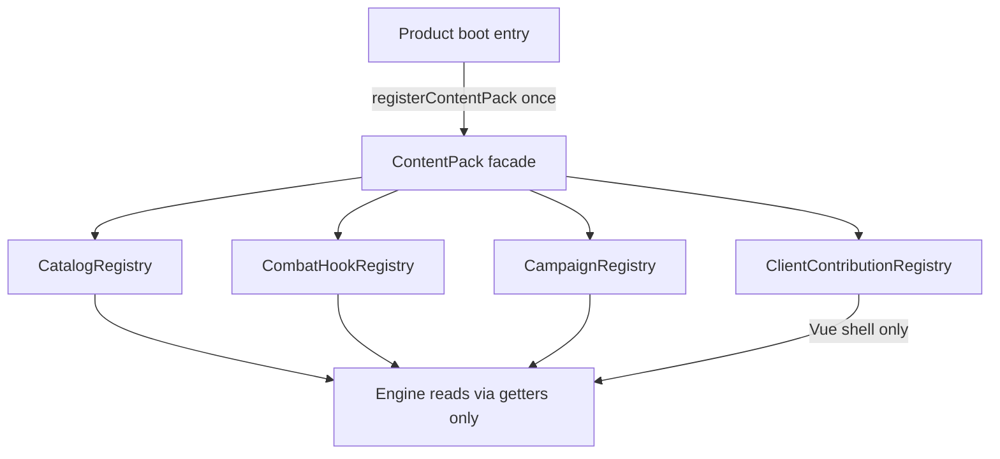
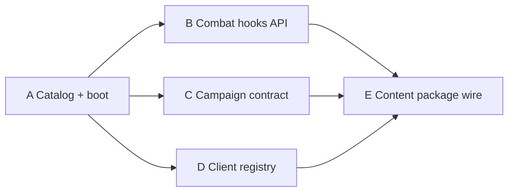

# Content-Pack Contract — Deep Dive & Plan Split

**Repo home:** [`vtt-core`](/Users/lindenholt/code/vtt-core) (this repository). Sibling `/Users/lindenholt/code/gaem` is archival.

**Status:** Tracks A–E strangler landed (`@gaem/hellpiercers-content`, product boots, ADRs 001–005). Close-gaps Phases 0–4 + Area #1 Open B exit **done**. Parent **#2** types untangle **done**. **Remaining:** private remote cutover; parent **#7** stays deferred. See [content-package-private-cutover.md](/Users/lindenholt/code/vtt-core/docs/content-package-private-cutover.md).

## Verdict

**Do not implement “the whole ContentPack API” in one plan.** The surface spans catalogs, combat hooks, campaign state, client UI/assets, and boot wiring across shared + both backends + Vue. Shipping it as one track mixes type redesign, combat refactors, and packaging.

Treat **ContentPack** as a thin facade that composes **sub-registries**. Implement and plan those sub-registries separately; keep a stable boot API (`registerContentPack` / `requireContentPack`) from day one so later slices plug in without redoing wiring.

---

## Target architecture (contract shape)



### Non-negotiable design decisions (lock these across all sub-plans)

- **Sync, eager registration only** — no async pack load, no runtime KV content. Matches Express + CF Worker/DO (identical apply path).
- **Register once at process/isolate boot** before handling REST/WS. Fail hard if registries are empty when engine code runs (`requireContentPack()`).
- **Shared never imports pack modules** — only getters/hooks on the registry. Product boots (`client` / `server` / `cf-worker`) import `@gaem/hellpiercers-content/register`.
- **Existing patterns to extend**, not invent from scratch:
  - [`registerCountdownHandler`](packages/shared/src/combat/countdown.ts)
  - [`registerAgnosiaHandler`](packages/shared/src/combat/agnosia.ts)
  - `EnemyAttack.specialId` already in [`combat/types.ts`](packages/shared/src/combat/types.ts)
- **Mutable module-level Maps** behind stable getters (same style as countdown/agnosia). Avoid DI containers.
- **Fixture mini-pack** for engine unit tests / CI so Hellpiercers JSON is not required to test the engine.

### Product vs engine dependency matrix

| Package | May depend on `@gaem/hellpiercers-content`? |
|---------|-----------------------------------------------|
| `@gaem/shared` | **No** |
| `@gaem/client` | **Yes** — product shell + boot |
| `@gaem/server` | **Yes** — product boot |
| `@gaem/cf-worker` | **Yes** — product boot |
| `@gaem/e2e` | Via product boots (not a direct content import required) |

ADR 005 “engine packages do not list content” means **`@gaem/shared`** (and any future pure shell), not product entries.

### Combat install bridge (interim)

Named HP combat implementations live in `@gaem/hellpiercers-content` and register via `CombatHookContribution.modules` (+ hooks). Shared dispatches with `combatMod(key)` / internal `content-modules-api` (not barrel-exported). Client UI helpers use `@gaem/hellpiercers-content/combat-ui`. Facade/`ContentCombatKey` install bridge **retired**.

### ContentPack facade (conceptual)

```ts
// Illustrative — exact fields owned by sub-plans
type ContentPack = {
  id: string;
  version: string;
  catalogs?: CatalogContribution;
  combat?: CombatHookContribution;
  campaign?: CampaignContribution;
  // client contributions registered only from client boot, not worker
};
```

Server/cf-worker register `{ catalogs, combat, campaign }`. Client registers the same plus UI/assets via `registerClientContentPack` so Worker never pulls Vue.

### Boot seams (current)

| Runtime | Register |
|---------|----------|
| Express | `@gaem/hellpiercers-content/register` at top of [`packages/server/src/index.ts`](packages/server/src/index.ts) |
| CF Worker + DO | same in [`packages/cf-worker/src/index.ts`](packages/cf-worker/src/index.ts) and [`game-room.ts`](packages/cf-worker/src/game-room.ts) |
| Client | `@gaem/hellpiercers-content/register` then `./register-client` in [`packages/client/src/main.ts`](packages/client/src/main.ts) |
| Shared Vitest | Fixture pack in setupFiles (`createFixtureContentPack()` + combat stubs) |
| Client Vitest | Fixture shared pack + fixture client contribution |
| Content Vitest | `registerHellpiercersContent()` |
| E2e | Product boots register Hellpiercers |

---

## Open B remainders (post Track B proof + close-gaps Phase 3)

Hook registry and most named modules are pack-owned. Checklist below is the **remaining** peel for IP-clean shared combat (see also ADR 002).

**Done (close-gaps Phase 3):**

- [x] `specialId: "orobas-stained-line"` — handler in content
- [x] `onHit: teleportToStain` — removed (dead type)
- [x] Provoke **name gates** — content `provoke-rules.ts` install module (shared still exports interim constants)
- [x] WS nesting (partial) — `armorAction` kinds `tower_teleport` / `katapty_end_turn`; legacy top-level aliases kept; `heavenBurningUnfold` still under `weaponActive`; `confirmGorgenautAgnosia` still top-level `ClientMessage`

**Still open:** none for Open B. All four remainders closed (Area #1 gap-close).

“Engine IP-free” for combat is satisfied for Open B — parent #2 `GameState` nesting already done; private remote cutover still separate.

---

## Explicit non-goals of Tracks A–E (and close-gaps code phases)

- ~~Nested `GameState.campaign` / full types untangling~~ — **parent area #2 done**
- KV sheet migrations / pack `id`+`version` on room state — **parent area #7**
- Runtime-downloaded packs, hot-reload, multi-pack
- Renaming `@gaem/*`
- New deploy platforms

### What “engine IP-free” means (and does not)

| Required for A–E / close-gaps “IP-free” claims | Explicitly **not** required |
|------------------------------------------------|-----------------------------|
| Catalogs/JSON/assets/maps/rulebook out of `@gaem/shared` | Sheet/pack-version KV migrations (#7) |
| Product boots register content only | Private remote cutover itself (separate; see below) |
| Client peel (panels/themes/globs in content) | Combat protocol union shrink / facade retirement (Open B / #3) |
| Fixture-default engine Vitest | |
| Nested `GameState.campaign` + campaign hooks (#2 **done**) | |
| Open B remainders above (for *combat* IP-clean shared) | |

Facade filenames / `ContentCombatKey` remain allowed until facade retirement (cutover grep policy).

---

## Inventory that the contract must eventually cover

### A. Catalogs

Loaders are registry-backed (`*-data.ts` getters). Live JSON lives under `packages/hellpiercers-content/src/data/`.

### B. Combat hooks

`CombatHookContribution` + `specialId` / countdown / agnosia Maps. Implementations in content; shared facades interim (above). Open remainders listed above.

### C. Campaign / state extensions

Campaign catalogs register via pack. Nested `GameState.campaign` + hooks: parent #2 **done** ([shared_types_untangle_0a64d3ba](/Users/lindenholt/.cursor/plans/shared_types_untangle_0a64d3ba.plan.md); supersedes [5104aaf5](/Users/lindenholt/.cursor/plans/shared_types_untangle_5104aaf5.plan.md)).

### D. Client contributions

`registerClientContentPack` for themes, tile labels, mainSections, document title, branding, detail panels. **Client peel + branding done** — HP panels/CSS/`import.meta.glob` tile modules live under content; content uses `@gaem/client/content-pack` (no `../../../client` imports). Thin client `lib/bundledTile*.ts` re-exports from `@gaem/hellpiercers-content/tiles` remain as product passthroughs. Landing hero + favicon via `ClientContribution.branding`; party resource labels via shared campaign getters.

---

## Private cutover readiness

In-repo strangler is green. Before replacing the workspace folder with a private git/npm dep, freeze these (detail in [content-package-private-cutover.md](/Users/lindenholt/code/vtt-core/docs/content-package-private-cutover.md)):

1. **Peer graph** — `@gaem/hellpiercers-content` peerDepends on `@gaem/shared` **and** `@gaem/client` (Vue panels). Private repo must either keep that peer (product publishes a client content-pack API) or invert ownership of SFCs.
2. **Exports** — Stable: `./register` (built `dist/`), `./register-client` (source TS today), `./tiles` (source TS — not in the original dual-export sketch; required for client passthroughs / Vite globs).
3. **Build asymmetry** — Worker/Express resolve `./register` via wrangler alias → content `src/register.ts` (or `dist` after build). Client Vite resolves `register-client` + `tiles` as source. Document whichever shape private install uses.
4. **Workers Builds auth** — deploy key / `.npmrc` so `npm install` can fetch the private package; dry-run before deleting the workspace copy.
5. **Grep acceptance** — catalogs/art/rulebook absent from shared; no content→client relative imports. Also clear leftover brand strings in shared production TS where practical (e.g. `"HELLPIERCERS"` in [`rule-text.ts`](packages/shared/src/rule-text.ts)) before a public engine tree.

---

## Recommended separate implementation plans

### Track A — Catalog registry + boot lifecycle — **done (strangler)**

### Track B — Combat hook registry contract — **done** (Open B remainders closed)

### Track C — Campaign / sheet extension contract — **done** (config + nesting + hooks via parent #2)

### Track D — Client contribution registry — **done** (API + AppShell + SFC/glob/theme peel)

### Track E — Product wiring toward private content package — **in-repo package + boots + fixture CI done; private remote cutover open**

Follow-on (mostly complete; remaining slices):

| Slice | Plan / doc |
|-------|------------|
| Close review gaps (Phases 0–4) | [close_content_pack_gaps_250ee351.plan.md](/Users/lindenholt/.cursor/plans/close_content_pack_gaps_250ee351.plan.md) — **done** |
| Facade retirement + remaining B peel | ADR 002 + Open B remainders above |
| Private remote cutover | [content-package-private-cutover.md](/Users/lindenholt/code/vtt-core/docs/content-package-private-cutover.md) |

Historical track plans:

| Track | Plan |
|-------|------|
| A Catalog + boot | [track_a_catalog_registry_f12ff8be.plan.md](/Users/lindenholt/.cursor/plans/track_a_catalog_registry_f12ff8be.plan.md) |
| B Combat hooks | [track_b_combat_hooks_7ccf0d79.plan.md](/Users/lindenholt/.cursor/plans/track_b_combat_hooks_7ccf0d79.plan.md) |
| C Campaign contract | [track_c_campaign_contract_f4db5016.plan.md](/Users/lindenholt/.cursor/plans/track_c_campaign_contract_f4db5016.plan.md) |
| D Client registry | [track_d_client_registry_85a3763a.plan.md](/Users/lindenholt/.cursor/plans/track_d_client_registry_85a3763a.plan.md) |
| E Content package wire | [track_e_content_package_wire_a8c3d1e2.plan.md](/Users/lindenholt/.cursor/plans/track_e_content_package_wire_a8c3d1e2.plan.md) |

**Executed:** A → (B ∥ C ∥ D) → E strangler → close-gaps Phases 0–4 → parent #2 types untangle → Area #1 Open B exit. **Next:** private cutover when ready. Parent **#7** separate.

---

## What a “ContentPack contract” doc should freeze (shared across tracks)

ADRs 001–005 cover:

1. Facade vs sub-registries
2. Sync register-once lifecycle + test reset
3. Getter stability during strangler
4. Client vs server contribution split (no Vue in Worker)
5. Pack `id` + `version` recorded on the registered pack for debug (persist on game/room deferred to #7)
6. Explicit non-goals: runtime downloads, hot-reload packs, multiple simultaneous packs
7. Product vs shared dependency matrix; install-bridge interim; private-cutover export/peer/auth notes (ADR 005 + cutover doc)

---

## Suggested sequencing (historical)



---

## Relationship to parent plan

Updates parent area **#1**: five-track split. Parent **#3 Combat pluginization** = Open B remainders (facade retirement + agnosia/provoke/WS peel). Parent **#2 Types** ≈ Track C + [0a64d3ba](/Users/lindenholt/.cursor/plans/shared_types_untangle_0a64d3ba.plan.md) (**done**). Parent **#4 Client** ≈ Track D (**done**). Parent **#5/#6/#8/#9** ≈ Track E in-repo (**done**) + private cutover doc. Parent **#10** legal/grep ≈ cutover acceptance (+ leftover brand strings / facade retirement).
